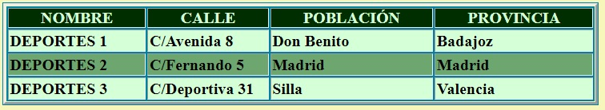
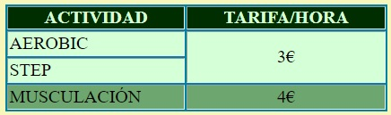
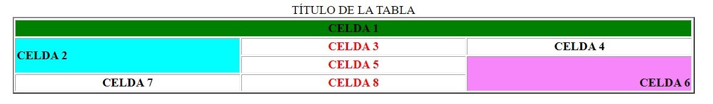
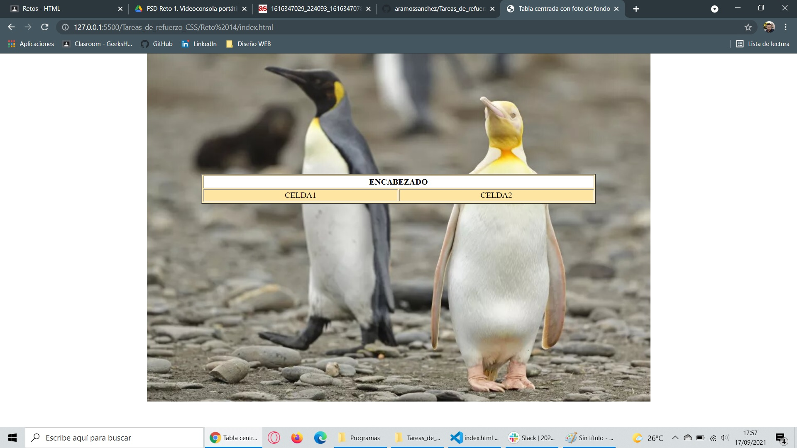
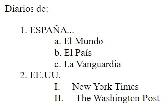
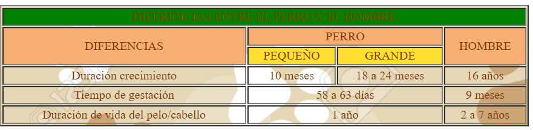
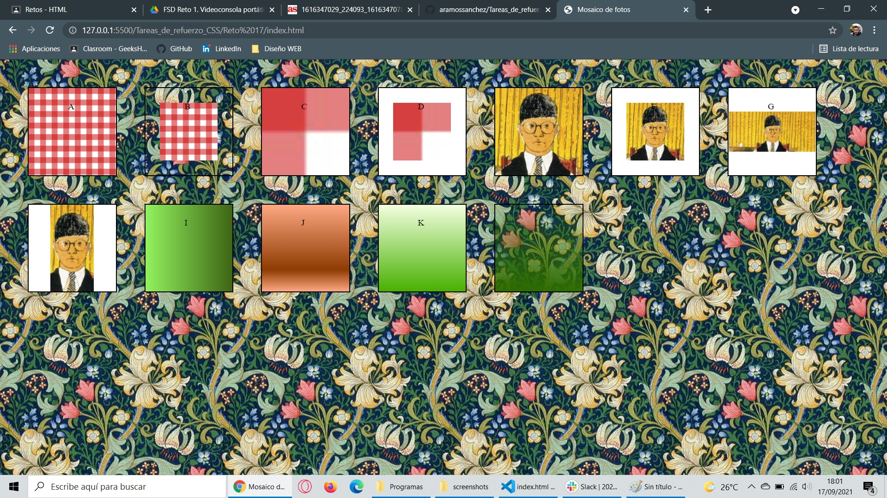
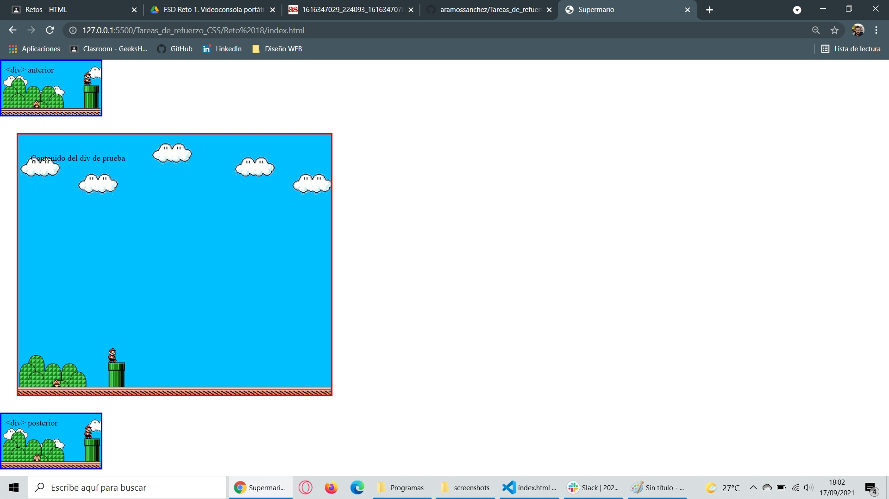
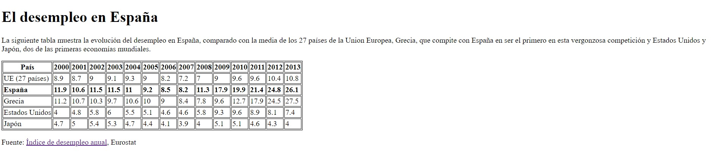
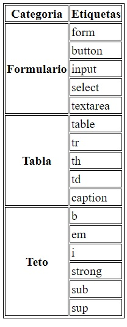

# Tareas de refuerzo CSS

## Realizamos varios retos basados en tecnología HTML y CSS
 
Los retos consisten en replicar las páginas que se muestran para cada reto.
 
Se puede ver el resultado de cada reto bien en los pantallazos o bien en el .html con los enlaces a cada uno de ellos.

### Reto 11:

### Reto 12:

### Reto 13:

### Reto 14:

### Reto 15:

### Reto 16:

### Reto 17:

### Reto 18:

### Reto 19:

### Reto 20:
